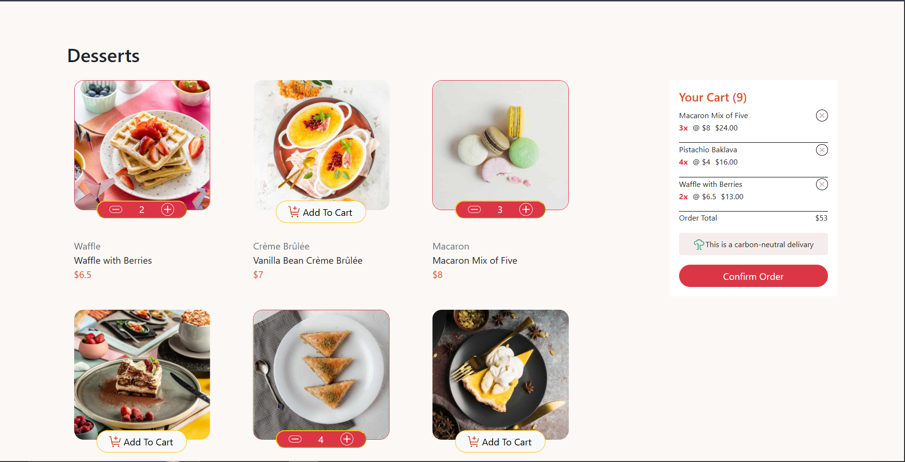
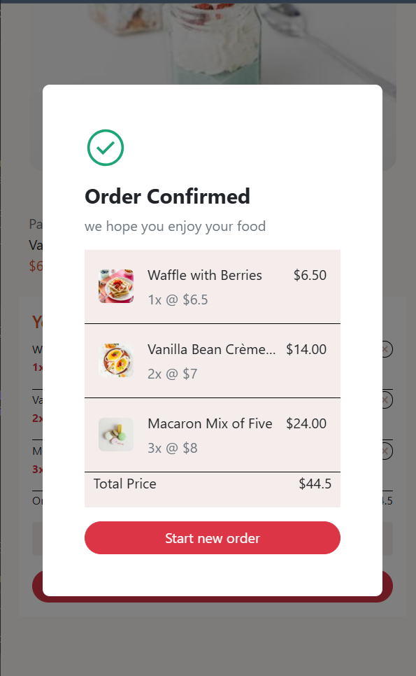

# Frontend Mentor - Product List with Cart Solution

This is a solution to the [Product list with cart challenge on Frontend Mentor](https://www.frontendmentor.io/challenges/product-list-with-cart-5MmqvCE2Dh). Frontend Mentor challenges help you improve your coding skills by building realistic projects.

## Table of contents

- [Overview](#overview)
  - [The challenge](#the-challenge)
  - [Screenshot](#screenshot)
  - [Links](#links)
- [My process](#my-process)
  - [Built with](#built-with)
  - [What I learned](#what-i-learned)
  - [Continued development](#continued-development)
- [Author](#author)

## Overview

### The challenge

Users should be able to:

- Add items to the cart and remove them
- Increase/decrease the number of items in the cart
- See an order confirmation modal when they click "Confirm Order"
- Reset their selections when they click "Start New Order"
- View the optimal layout for the interface depending on their device's screen size
- See hover and focus states for all interactive elements on the page

### Screenshot




### Links

- Solution URL: [Add your GitHub repo link here](https://your-repo-link.com)
- Live Site URL: [Add your live site link here](https://your-live-site-link.com)

## My process

### Built with

- Semantic HTML5 markup
- CSS custom styles
- [Bootstrap 5](https://getbootstrap.com/) - for the grid system and utility classes
- Flexbox
- CSS Grid / Bootstrap responsive columns
- Mobile-first workflow
- Vanilla JavaScript (DOM manipulation, no frameworks)

### What I learned

This project was a deep dive into vanilla JavaScript DOM manipulation and state management without relying on a framework like React. Some of the key concepts I practiced and solidified:

**Event delegation**

Since cart items are rendered dynamically, event listeners attached directly to elements are lost every time the HTML is re-rendered. Instead of re-attaching listeners after every render, I used event delegation by listening on a stable parent container and using `closest()` to identify which specific element was clicked:

```js
rowData2.addEventListener("click", deleteItem);

function deleteItem(event) {
  let removeButton = event.target.closest(".remove-item");
  if (!removeButton) return;
  // ...
}
```

**Linking DOM elements back to data using `data-*` attributes**

To know exactly which product a click event belonged to, I stored the product's index as a `data-index` attribute on each card at render time, then read it back inside event handlers:

```js
let index = Number(card.dataset.index);
let product = products[index];
```

**Keeping a single source of truth**

Instead of reading quantities and prices directly from the DOM, I kept a `cartItems` array as the single source of truth for the cart's state. Every UI update (cart count, order total, item list, confirmation modal) is derived from this array and re-rendered through a dedicated `renderCart()` function.

**Array methods: `find`, `filter`, and `reduce`**

- `find()` to check whether a product already exists in the cart before adding a duplicate
- `filter()` to remove an item from the cart array entirely
- `reduce()` to calculate the total quantity and total price across all cart items

**Variable scope**

I learned the difference between global and local scope the hard way — attempting to store values like the clicked card or its index as global variables caused bugs, since those values are only meaningful within the context of a single event handler. Keeping them local to each function made the code far more predictable.

### Continued development

Things I'd like to keep improving in future projects:

- Explore rebuilding this project with React to compare state management approaches (`useState` vs. manually keeping a JS array in sync with the DOM)
- Add more refined accessibility support (`aria-label`s on icon-only buttons, focus trapping inside the modal)
- Practice organizing vanilla JS projects into smaller, more reusable modules instead of one large file

## Author

- Frontend Mentor - [@Amro](https://www.frontendmentor.io/profile/Amro6779)
